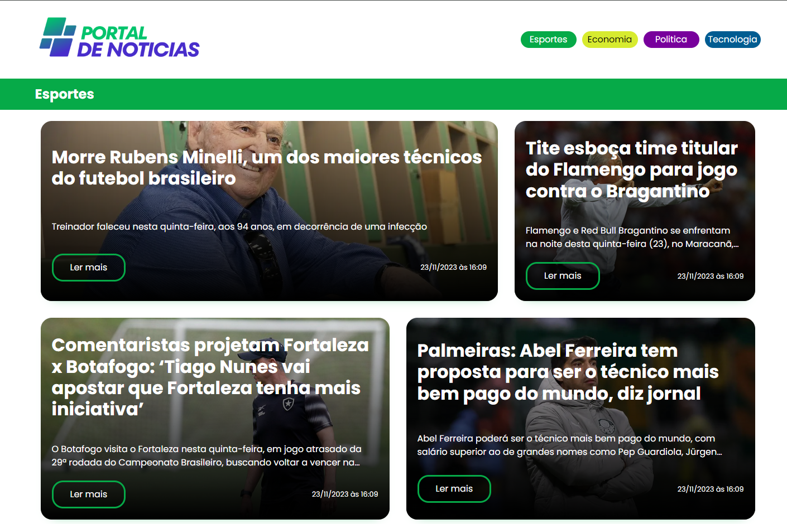
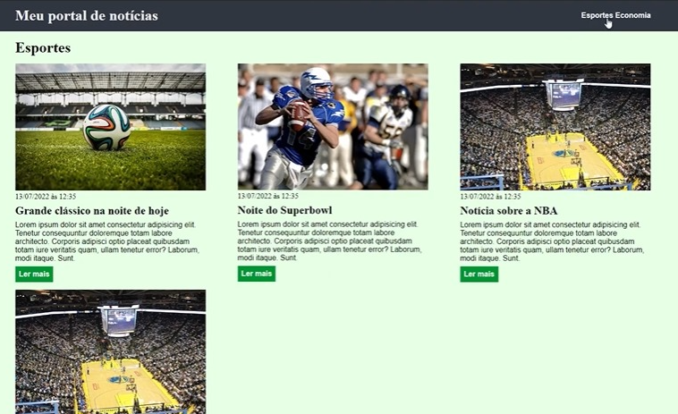

<h1>Resultado</h1>

Real time
https://willfra.github.io/exercicio-modulo-4/ 

<h2>Orientações:</h2>

A entrega desse exercício consiste em:

• Criar mais duas seções no layout criado durante o módulo, exemplos: entretenimento e tecnologia, as novas seções devem conter outras notícias e diferentes cores.

• Envie os arquivos para o Github em uma branch chamada exercício_css e nos envie o link
